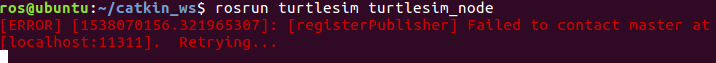

# Robotics Operating System (ROS)

## IMPORTANT Notes

- `roscore` should be run before anything. Read about [roscore](#roscore).


## Table of Contents

- [Workspace](#workspace)
- [Packages](#packages)
- [Publishers and Subscribers](#publishers-and-subscribers)
- [Messages](#messages)
- [Services](#services)
- [Network Configuration](#network-configuration)
- [Perception](#perception)
- [Robots](#robots)
  * [Turtlesim](#turtlesim)
  * [Turtlebot](#turtlebot)
- [Commands](#commands)
  * [roscore](#roscore)
  * [rosnode](#rosnode)
  * [rostopic](#rostopic)
  * [rosmsg](#rosmsg)
  * [rossrv](#rossrv)
  * [rosrun](#rosrun)
  * [roslaunch](#roslaunch)
  * [roscd](#roscd)
  * [rosservice](#rosservice)
- [Others](#others)
- [Troubleshooting](#troubleshooting)

---

## Workspace

### Configure Workspace

Add the following command into `.bashrc` file to activate the ROS default workspace

```sh
source /opt/ros/kinetic/setup.bash
```

### Create Workspace

- Reference: http://wiki.ros.org/ROS/Tutorials/InstallingandConfiguringROSEnvironment

- `catkin` workspace will be used to create and store your own ROS packages (project).

- `catkin` is the name of the build tool used to compile and execute programs in ROS.

Create `catkin` workspace (catkin_ws) in `HOME` directory

```sh
mkdir -p ~/catkin_ws/src
cd ~/catkin_ws/
catkin_make
```

### Make The New Workspace The Default One

Add the following command in `.bashrc` (in HOME directory)

```sh
source /home/riotu/catkin_ws/devel/setup.bash 
```

replace `riotu` by your username

---

## Packages

> ROS package (project) that you will use to develop programs.

### Create Package

1. Go to the `src` folder

```sh
cd ~/catkin_ws/src/
```

2. Create your package (specify the dependencies)

```sh
catkin_create_pkg cs460_package std_msgs rospy roscpp
```

3. Go to `catkin_ws` and compile to generate executable and configuration files for the project

```sh
cd ..
catkin_make
```

---

## Publishers and Subscribers

To understand ROS tobics [READ](understand-ros-topics.pdf)

### Get Publisher and Subscribers of a Tobic

```sh
$ rostopic info /chatter
Type: std_msgs/String

Publishers: 
 * /talker_30225_1538066475268 (http://ubuntu:36549/)

Subscribers: 
 * /listener_30271_1538066488910 (http://ubuntu:38827/)

```

You can get the available topics by typing

```sh
rostopic list
```

Read about [rostopic](#rostopic)

### Publisher

<details>
<summary>talker.py</summary>

```python
#!/usr/bin/env python
# license removed for brevity
import rospy
from std_msgs.msg import String

def talker():
    #create a new publisher. we specify the topic name, then type of message then the queue size
    pub = rospy.Publisher('chatter', String, queue_size=10)
    #we need to initialize the node
    # In ROS, nodes are uniquely named. If two nodes with the same
    # node are launched, the previous one is kicked off. The
    # anonymous=True flag means that rospy will choose a unique
    # name for our 'talker' node 
    rospy.init_node('talker', anonymous=True)
    #set the loop rate
    rate = rospy.Rate(1) # 1hz
    #keep publishing until a Ctrl-C is pressed
    i = 0
    while not rospy.is_shutdown():
        hello_str = "hello world %s" % i
        rospy.loginfo(hello_str)
        pub.publish(hello_str)
        rate.sleep()
        i=i+1

if __name__ == '__main__':
    try:
        talker()
    except rospy.ROSInterruptException:
        pass

```

</details>

Run the publisher

```sh
$ rosrun ros_essentials_cpp talker.py
[INFO] [1538046986.881161]: hello world 0
[INFO] [1538046987.895407]: hello world 1
[INFO] [1538046988.882495]: hello world 2
[INFO] [1538046989.883143]: hello world 3
[INFO] [1538046990.882535]: hello world 4
...
```

Read about [rosrun](#rosrun)

### Subscriber

<details>
<summary>listener.py</summary>

```python
#!/usr/bin/env python
import rospy
from std_msgs.msg import String

def callback(message):
    #get_caller_id(): Get fully resolved name of local node
    rospy.loginfo(rospy.get_caller_id() + "I heard %s", message.data)
    
def listener():

    # In ROS, nodes are uniquely named. If two nodes with the same
    # node are launched, the previous one is kicked off. The
    # anonymous=True flag means that rospy will choose a unique
    # name for our 'listener' node so that multiple listeners can
    # run simultaneously.
    rospy.init_node('listener', anonymous=True)

    rospy.Subscriber("chatter", String, callback)

    # spin() simply keeps python from exiting until this node is stopped
    rospy.spin()

if __name__ == '__main__':
    listener()

```

</details>

Run the subscriber

```sh
$ rosrun ros_essentials_cpp listener.py
[INFO] [1538047021.884116]: /listener_4579_1538047020918I heard hello world 35
[INFO] [1538047022.883483]: /listener_4579_1538047020918I heard hello world 36
[INFO] [1538047023.883734]: /listener_4579_1538047020918I heard hello world 37
[INFO] [1538047024.883639]: /listener_4579_1538047020918I heard hello world 38
...
```

Read about [rosrun](#rosrun)

---


## Messages

- Syntax: package_name/message_type
- Unsigned int only takes positive values.

### Created Messages 

#### `std_msgs` Message

>Message of type string that contains only one field
which is called data.

### Set up New Message

1. Create `msg` folder in the package (e.g. ros_service_assignment).

2. Create `IoTSensor.msg` file in `msg` folder.

3. Add the message values in `IoTSensor.msg` file. Example:

```plain
int32 id
string name
float32 temperature
float32 humidity
```

4. Add two dependencies in `package.xml`

```xml
<build_depend>message_generation</build_depend>
<exec_depend>message_runtime</exec_depend>
```

5. Modify or add the following in `CMakeLists.txt`

- Add `message_generation`

```plain
## Find catkin macros and libraries
## if COMPONENTS list like find_package(catkin REQUIRED COMPONENTS xyz)
## is used, also find other catkin packages
find_package(catkin REQUIRED COMPONENTS
  roscpp
  rospy
  std_msgs
  message_generation
)
```

- Uncomment and add `IoTSensor.msg` (`.msg` file)

```plain
## Generate messages in the 'msg' folder
add_message_files(
   FILES
   IoTSensor.msg
)
```

- Uncomment the following

```plain
## Generate added messages and services with any dependencies listed here
 generate_messages(
   DEPENDENCIES
   std_msgs
 )
```

- Uncomment and add `message_runtime`

```plain
###################################
## catkin specific configuration ##
###################################
## The catkin_package macro generates cmake config files for your package
## Declare things to be passed to dependent projects
## INCLUDE_DIRS: uncomment this if your package contains header files
## LIBRARIES: libraries you create in this project that dependent projects also need
## CATKIN_DEPENDS: catkin_packages dependent projects also need
## DEPENDS: system dependencies of this project that dependent projects also need
catkin_package(
  INCLUDE_DIRS include
  LIBRARIES ros_service_assignment
  CATKIN_DEPENDS roscpp rospy std_msgs message_runtime
  DEPENDS system_lib
)

```

6. Run in terminal

```sh
cd catkin_ws
catkin_make
```

7. Check if everything is fine 

- It must contain `ros_cs460_package/IoTSensor`

```sh
$ rosmsg list
...
ros_cs460_package/IoTSensor
...
```

### Use Message

<details>

<summary>iot_sensor_publisher.py</summary>

```python
#!/usr/bin/env python
# license removed for brevity
import rospy
from ros_cs460_package.msg import IoTSensor
import random

#create a new publisher. we specify the topic name, then type of message then the queue size
pub = rospy.Publisher('iot_sensor_topic', IoTSensor, queue_size=10)

#we need to initialize the node
rospy.init_node('iot_sensor_publisher_node', anonymous=True)

#set the loop rate
rate = rospy.Rate(1) # 1hz
#keep publishing until a Ctrl-C is pressed
i = 0
while not rospy.is_shutdown():
    iot_sensor = IoTSensor()
    iot_sensor.id = 1
    iot_sensor.name="iot_parking_01"
    iot_sensor.temperature = 24.33 + (random.random()*2)
    iot_sensor.humidity = 33.41+ (random.random()*2)
    rospy.loginfo("I publish:")
    rospy.loginfo(iot_sensor)
    pub.publish(iot_sensor)
    rate.sleep()
    i=i+1

```

</details>

<details>
<summary>iot_sensor_subscriber.py</summary>

```python
#!/usr/bin/env python
import rospy
from ros_cs460_package.msg import IoTSensor

def iot_sensor_callback(iot_sensor_message):
    rospy.loginfo("new IoT data received: (%d, %s, %.2f ,%.2f)", 
        iot_sensor_message.id,iot_sensor_message.name,
        iot_sensor_message.temperature,iot_sensor_message.humidity)
    
rospy.init_node('iot_sensor_subscriber_node', anonymous=True)

rospy.Subscriber("iot_sensor_topic", IoTSensor, iot_sensor_callback)

# spin() simply keeps python from exiting until this node is stopped
rospy.spin()
```

</details>

- Run the publisher

```sh
$ rosrun ros_cs460_package iot_sensor_publisher.py
[INFO] [1538065355.755153]: I publish:
[INFO] [1538065355.758797]: id: 1
name: "iot_parking_01"
temperature: 24.6894078555
humidity: 34.139884549
[INFO] [1538065356.756542]: I publish:
[INFO] [1538065356.758693]: id: 1
name: "iot_parking_01"
temperature: 26.2780855119
humidity: 33.8374695749
...
```

- Run the subscriber

```sh
$ rosrun ros_cs460_package iot_sensor_subscriber.py
[INFO] [1538065376.763998]: new IoT data received: (1, iot_parking_01, 25.33 ,35.15)
[INFO] [1538065377.765967]: new IoT data received: (1, iot_parking_01, 25.77 ,34.45)
...
```

Read about [rosrun](#rosrun)

---

## Services

>It is similar to webservices, it is just a request and a response and the connection is not open all the time.

### Set up Client/Server

1. Create `srv` folder in the package (e.g. ros_service_assignment).

2. Create `RectangleAeraService.srv` file in `srv` folder.

3. Add the request and response values in `RectangleAeraService.srv` file. Example:

```plain
float32 width
float32 height
---
float32 area
```

- First part (before `---`) is the request part.
- Second part (after `---`) is the response part.

4. Add two dependencies in `package.xml`

```xml
<build_depend>message_generation</build_depend>
<exec_depend>message_runtime</exec_depend>
```

5. Modify or add the following in `CMakeLists.txt`

- Add `message_generation`

```plain
## Find catkin macros and libraries
## if COMPONENTS list like find_package(catkin REQUIRED COMPONENTS xyz)
## is used, also find other catkin packages
find_package(catkin REQUIRED COMPONENTS
  roscpp
  rospy
  std_msgs
  message_generation
)
```

- Uncomment and add `RectangleAeraService.srv` (`.srv` file)

```plain
## Generate services in the 'srv' folder
add_service_files(
   FILES
   RectangleAeraService.srv
 )
```

- Uncomment the following

```plain
## Generate added messages and services with any dependencies listed here
 generate_messages(
   DEPENDENCIES
   std_msgs
 )
```

- Uncomment and add `message_runtime`

```plain
###################################
## catkin specific configuration ##
###################################
## The catkin_package macro generates cmake config files for your package
## Declare things to be passed to dependent projects
## INCLUDE_DIRS: uncomment this if your package contains header files
## LIBRARIES: libraries you create in this project that dependent projects also need
## CATKIN_DEPENDS: catkin_packages dependent projects also need
## DEPENDS: system dependencies of this project that dependent projects also need
catkin_package(
  INCLUDE_DIRS include
  LIBRARIES ros_service_assignment
  CATKIN_DEPENDS roscpp rospy std_msgs message_runtime
  DEPENDS system_lib
)

```

6. Run in terminal

```sh
cd catkin_ws
catkin_make
```

7. Check if everything is fine

- It must contain `ros_service_assignment/RectangleAeraService`

```sh
$ rossrv list
...
ros_service_assignment/RectangleAeraService
...
```

Read about [rossrv](#rossrv)

### Use Client/Server

<details>

<summary>area_server.py</summary>

```python
#!/usr/bin/env python

from ros_service_assignment.srv import RectangleAeraService
from ros_service_assignment.srv import RectangleAeraServiceRequest
from ros_service_assignment.srv import RectangleAeraServiceResponse

import rospy

def handle_find_area(req):
    print "Returning [%s * %s = %s]"%(req.width, req.height, (req.width * req.height))
    return RectangleAeraServiceResponse(req.width * req.height)

def find_area_server():
    rospy.init_node('find_area_server')
    s = rospy.Service('find_area', RectangleAeraService, handle_find_area)
    print "Ready to find_area."
    rospy.spin()
    
if __name__ == "__main__":
    find_area_server() 
```
</details>

<details>

<summary>area_client.py</summary>

```python
#!/usr/bin/env python

import sys
import rospy
from ros_service_assignment.srv import RectangleAeraService
from ros_service_assignment.srv import RectangleAeraServiceRequest
from ros_service_assignment.srv import RectangleAeraServiceResponse

def find_area_client(x, y):
    rospy.wait_for_service('find_area')
    try:
        find_area = rospy.ServiceProxy('find_area', RectangleAeraService)
        resp1 = find_area(x, y)
        return resp1.area
    except rospy.ServiceException, e:
        print "Service call failed: %s" % e

def usage():
    return "%s [x y]"%sys.argv[0]

if __name__ == "__main__":
    if len(sys.argv) == 3:
        x = int(sys.argv[1])
        y = int(sys.argv[2])
    else:
        print usage()
        sys.exit(1)
    print "Requesting %s*%s"%(x, y)
    print "%s * %s = %s"%(x, y, find_area_client(x, y))
```

</details>

In two sperate terminals run the following commands (one terminal per command)

```sh
$ rosrun ros_service_assignment area_server.py
Ready to find_area.
```

```sh
$ rosrun ros_service_assignment area_client.py 3 4
Requesting 3*4
3 * 4 = 12.0
```

Read about [rosrun](#rosrun)

---

## Network Configuration

Add the following in `.bashrc`

```sh
#The IP address for the Master node
export ROS_MASTER_URI=http://192.168.8.111:11311
#The IP address for your device/host IP address
export ROS_HOSTNAME=192.168.8.126
```

- `192.168.8.111` is IP address for the Master node.

- `192.168.8.126` is the IP address for your device/host IP address

To get your IP address

In Windows

```sh
ipconfig
```

In Ubuntu 

```sh
ifconfig
```

To learn more 
https://edu.gaitech.hk/turtlebot/network-config-doc.html

---


## Perception

### Images

#### OpenCV

> Open Source Computer Vision Library.

- For 2D Image Processing.

- To use OpenCV effectively `import numpy`, it is used to trait images as arrays.

- Read about [Contours](https://docs.opencv.org/3.3.1/d4/d73/tutorial_py_contours_begin.html)

- Read about [Thresholding](https://docs.opencv.org/3.4.0/d7/d4d/tutorial_py_thresholding.html)

### Laser

- Read about [LaserScanner](http://wiki.ros.org/laser_pipeline/Tutorials/IntroductionToWorkingWithLaserScannerData)


## Robots

### Turtlesim

Refernces <br>
[01] http://wiki.ros.org/turtlesim <br>
[02] http://wiki.ros.org/ROS/Tutorials/UnderstandingServicesParams


#### Start Turtlesim

```sh
rosrun turtlesim turtlesim_node
```

Read about [rosrun](#rosrun)

#### Move Turtle By Using Keyboard

```sh
rosrun turtlesim turtle_teleop_key
```

Read about [rosrun](#rosrun)

#### Create Another Turtle

>This service lets us spawn a new turtle at a given location and orientation. The name field is optional, so let's not give our new turtle a name and let turtlesim create one for us.

```sh
$ rosservice call /spawn 2 2 0.2 ""
name: turtle2
```

Learn more about [rosservice](http://wiki.ros.org/ROS/Tutorials/UnderstandingServicesParams)

#### Motion of Turtlesim

<details>

<summary>cleaner.py</summary>

```python
#!/usr/bin/env python

# Q1: What is the limit of rospy.Rate? 
# Q2: Is it always good to use large numbers for rospy.Rate? 

from turtlesim.msg import Pose
import rospy
from geometry_msgs.msg import Twist
import math
import time
#from std_srvs.srv import Empty

currentTurtlesimPose = Pose()

x_min = 0.0
y_min = 0.0
x_max = 11.0
y_max = 11.0


def poseCallback(pose_message):
    # To change the value of the parameters and get the global variables,
    # "global" keyword is used.  
    global currentTurtlesimPose
    # Get the information. 
    currentTurtlesimPose = pose_message

def move(speed, distance, is_forward):
    #declare a Twist message to send velocity commands
    velocity_message = Twist()

    #get current location from the global variable before entering the loop
    #x0=x
    #y0=y
    #z0=z;
    #yaw0=yaw;

     
    velocity_message.linear.y = 0
    velocity_message.linear.z = 0
    velocity_message.angular.x = 0
    velocity_message.angular.y = 0
    velocity_message.angular.z = 0

    # assign the x coordinate of linear velocity to the speed.
    if is_forward: 
        velocity_message.linear.x = abs(speed)
    else: 
        velocity_message.linear.x = -abs(speed)

    distance_moved = 0.0
    t0 = rospy.Time.now().to_sec()
    loop_rate = rospy.Rate(100) # we publish the velocity at 10 Hz (10 times a second)    

        #task 2. create a publisher for the velocity message on the appropriate topic.  
    #velocity_publisher = rospy.Publisher('/turtle1/cmd_vel', Twist, queue_size=10)

    while True :
            #task 3. publish the velocity message 
            velocity_publisher.publish(velocity_message)
            
            #rospy.Duration(1.0)


            #measure the distance moved
            t1 = rospy.Time.now().to_sec()
            distance_moved = (t1-t0)*speed
            loop_rate.sleep()
            print  distance_moved               
            if not (distance_moved < distance):
                rospy.loginfo("reached")
                break
    
    #task 4. publish a velocity message zero to make the robot stop after the distance is reached
    velocity_message.linear.x = 0
    velocity_publisher.publish(velocity_message)

def rotate(angular_speed, relative_angle, is_clockwise):
    #declare a Twist message to send velocity commands
    velocity_message = Twist()

    #get current location from the global variable before entering the loop 
    #x0=x
    #y0=y
    #z0=z;
    #yaw0=yaw
    

     
    velocity_message.linear.x = 0 
    velocity_message.linear.y = 0
    velocity_message.linear.z = 0
    velocity_message.angular.x = 0
    velocity_message.angular.y = 0

    # assign the x coordinate of linear velocity to the speed.
    if is_clockwise: 
        velocity_message.angular.z = -abs(angular_speed)
    else: 
        velocity_message.angular.z = abs(angular_speed)


    angle_moved = 0.0
    t0 = rospy.Time.now().to_sec()
    loop_rate = rospy.Rate(100) # we publish the velocity at 10 Hz (10 times a second), loop_rate.sleep() will wait for 1/10 seconds   


        #task 2. create a publisher for the velocity message on the appropriate topic.  
    #velocity_publisher = rospy.Publisher('/turtle1/cmd_vel', Twist, queue_size=10)

    while True :
        #task 3. publish the velocity message 
        velocity_publisher.publish(velocity_message)

        #loop_rate.sleep()
        
        #rospy.Duration(1.0)


        #measure the distance moved
        t1 = rospy.Time.now().to_sec()
        angle_moved = angular_speed * (t1-t0)
        loop_rate.sleep()
        print  angle_moved               
        if not (angle_moved < relative_angle):
            rospy.loginfo("reached")
            break
    
    #task 4. publish a velocity message zero to make the robot stop after the distance is reached
    velocity_message.angular.z = 0
    velocity_publisher.publish(velocity_message)

def degrees_to_radians(angle_in_degrees):
    return angle_in_degrees *math.pi /180.0

def get_distance(x1, y1, x2, y2):
    return math.sqrt(pow((x1-x2),2)+pow((y1-y2),2))

def set_desired_orientation (desired_angle_radians):
    relative_angle_radians = desired_angle_radians - currentTurtlesimPose.theta
    if relative_angle_radians < 0:
        clockwise = 1
    else:
        clockwise = 0
	rotate(degrees_to_radians(20), abs(relative_angle_radians), clockwise)

def move_to_goal(goal_pose, distance_tolerance):
    #declare a Twist message to send velocity commands
    velocity_message = Twist()

    loop_rate = rospy.Rate(100) # we publish the velocity at 10 Hz (10 times a second) 
    E = 0.0

    #task 2. create a publisher for the velocity message on the appropriate topic.  
    #velocity_publisher = rospy.Publisher('/turtle1/cmd_vel', Twist, queue_size=10)

    while True:

        kp = 1.0
        ki = 0.02

        e = get_distance(currentTurtlesimPose.x, currentTurtlesimPose.y, goal_pose.x, goal_pose.y)
        E = E+e

        velocity_message.linear.x = (kp*e)
        velocity_message.linear.y =0
        velocity_message.linear.z =0
		#angular velocity in the z-axis
        velocity_message.angular.x = 0
        velocity_message.angular.y = 0
        velocity_message.angular.z =4*(math.atan2(goal_pose.y-currentTurtlesimPose.y, goal_pose.x-currentTurtlesimPose.x)-currentTurtlesimPose.theta)

        velocity_publisher.publish(velocity_message)

        #rospy.spin()
        loop_rate.sleep()

        if not (get_distance(currentTurtlesimPose.x,currentTurtlesimPose.y, goal_pose.x, goal_pose.y)>distance_tolerance):
                rospy.loginfo("reached")
                break
    #task 4. publish a velocity message zero to make the robot stop after the distance is reached
    velocity_message.angular.z = 0
    velocity_message.linear.x = 0 
    velocity_publisher.publish(velocity_message)

def grid_clean():
    loop_rate = rospy.Rate(0.5)
    pose = Pose()
    pose.x=1
    pose.y=1
    pose.theta=0
    move_to_goal(pose, 0.01)
    loop_rate.sleep()
    set_desired_orientation(0)
    loop_rate.sleep()
    
    move(2.0, 9.0, True)
    loop_rate.sleep()
    rotate(degrees_to_radians(20), degrees_to_radians(90), False)
    loop_rate.sleep()
    move(2.0, 9.0, True)
    
    rotate(degrees_to_radians(20), degrees_to_radians(90), False)
    loop_rate.sleep()
    move(2.0, 1.0, True)
    rotate(degrees_to_radians(20), degrees_to_radians(90), False)
    loop_rate.sleep()
    move(2.0, 9.0, True)

    rotate(degrees_to_radians(30), degrees_to_radians(90), True)
    loop_rate.sleep()
    move(2.0, 1.0, True)
    rotate(degrees_to_radians(30), degrees_to_radians(90), True)
    loop_rate.sleep()
    move(2.0, 9.0, True)


    distance = get_distance(currentTurtlesimPose.x,currentTurtlesimPose.y, x_max, y_max)

def spiral_clean():
    #declare a Twist message to send velocity commands
    velocity_message = Twist()

    #velocity_publisher = rospy.Publisher('/turtle1/cmd_vel', Twist, queue_size=10)


    count = 0

    constant_speed = 4 
    vk = 1
    wk = 2 
    rk = 0.5
    loop_rate = rospy.Rate(1)

    while True:
        rk = rk+1.0 
        velocity_message.linear.x = rk 
        velocity_message.linear.y = 0 
        velocity_message.linear.z = 0 

        velocity_message.angular.x = 0
        velocity_message.angular.y = 0
        velocity_message.angular.z = constant_speed

        velocity_publisher.publish(velocity_message)

        loop_rate.sleep()

        if not (currentTurtlesimPose.x<10.5) and (currentTurtlesimPose.y<10.5):
            velocity_message.linear.x = 0
            velocity_publisher.publish(velocity_message)    


if __name__=='__main__':
    try:
        rospy.init_node('cleaner', anonymous=True)

        velocity_publisher = rospy.Publisher('/turtle1/cmd_vel', Twist, queue_size=10)

        position_topic = "/turtle1/pose"
        pose_subscriber = rospy.Subscriber(position_topic, Pose, poseCallback)

        option = input("For forward move: 0 \nFor angular move: 1\nFor goal move: 2\nFor grid clean: 3\nFor spiral clean: 4\n")
        
        if option == 0: 
            speed = input("Speed:")
            distance = input("Distance:")
            is_forward = input("Is Forward:")
            move(speed, distance, is_forward)
        elif option == 1: 
            angular_speed = input("Angular Speed:")
            relative_angle = input("Relative Angle:")
            is_clockwise = input("Is Clockwise:")
            rotate(degrees_to_radians(angular_speed), degrees_to_radians(relative_angle), is_clockwise)
        elif option == 2: 
            pose = Pose()
            pose.x=1
            pose.y=1
            pose.theta=0
            move_to_goal(pose, 0.01)
        elif option == 3:
            grid_clean()
        elif option == 4:
            spiral_clean()
        rospy.spin()
    except rospy.ROSInterruptException:
        rospy.loginfo("node terminated.")
```

</details>

`cleaner_py.launch` is used to run `turtlesim_node` and `cleaner.py` at the same time

```xml
<launch>
    <node name="turtlesim_node" pkg="turtlesim" type="turtlesim_node" output="screen"/>
    <node name="cleaner.py" pkg="ros_essentials_cpp" type="cleaner.py" output="screen"/>
</launch>
```

Run `cleaner_py.launch` 

```sh
roslaunch ros_essentials_cpp cleaner_py.launch
```

Read about [roslaunch](#roslaunch)

### Turtlebot

#### Install Turtlebot Packages


```sh
sudo apt-get install ros-kinetic-turtlebot-*
```

#### Start Turtlebot(Simulator)

```sh
roslaunch turtlebot_stage turtlebot_in_stage.launch
```

#### Start Turtlebot(Physical)

```sh
roslaunch turtlebot_bringup minimal.launch
```

#### Start Camera Node

```sh
roslaunch turtlebot_bringup 3dsensor.launch
```

#### Move Turtlebot By Using Keyboard

```sh
roslaunch turtlebot_teleop keyboard_teleop.lanuch
```

#### Motion of Turtlebot

<details>
<summary>turtlebot_cleaner.py</summary>

```python
#!/usr/bin/env python

import rospy
from geometry_msgs.msg import Twist
import math
import time
from std_srvs.srv import Empty

x=0
y=0
z=0
yaw=0


def move(speed, distance, is_forward):
        #declare a Twist message to send velocity commands
        velocity_message = Twist()
        #get current location 
        x0=x
        y0=y

        if (is_forward):
            velocity_message.linear.x =abs(speed)
        else:
        	velocity_message.linear.x =-abs(speed)

        distance_moved = 0.0
        loop_rate = rospy.Rate(10) # we publish the velocity at 10 Hz (10 times a second)    
        cmd_vel_topic='/cmd_vel_mux/input/teleop'
        velocity_publisher = rospy.Publisher(cmd_vel_topic, Twist, queue_size=10)

        t0 = rospy.Time.now().to_sec()

        while True :
                rospy.loginfo("Turtlebot moves forwards")
                velocity_publisher.publish(velocity_message)

                loop_rate.sleep()
                
                #rospy.Duration(1.0)
                t1 = rospy.Time.now().to_sec()
                distance_moved = (t1-t0)*speed
                print  distance_moved               
                if  not (distance_moved<distance):
                    rospy.loginfo("reached")
                    break
        
        #finally, stop the robot when the distance is moved
        velocity_message.linear.x =0
        velocity_publisher.publish(velocity_message)
    
def rotate (angular_speed_degree, relative_angle_degree, clockwise):
    
    global yaw
    velocity_message = Twist()
    velocity_message.linear.x=0
    velocity_message.linear.y=0
    velocity_message.linear.z=0
    velocity_message.angular.x=0
    velocity_message.angular.y=0
    velocity_message.angular.z=0

    #get current location 
    theta0=yaw
    angular_speed=math.radians(abs(angular_speed_degree))

    if (clockwise):
        velocity_message.angular.z =-abs(angular_speed)
    else:
        velocity_message.angular.z =abs(angular_speed)

    angle_moved = 0.0
    loop_rate = rospy.Rate(10) # we publish the velocity at 10 Hz (10 times a second)    
    cmd_vel_topic='/cmd_vel_mux/input/teleop'
    velocity_publisher = rospy.Publisher(cmd_vel_topic, Twist, queue_size=10)

    t0 = rospy.Time.now().to_sec()

    while True :
        rospy.loginfo("Turtlebot rotates")
        velocity_publisher.publish(velocity_message)

        t1 = rospy.Time.now().to_sec()
        current_angle_degree = (t1-t0)*angular_speed_degree
        loop_rate.sleep()


                       
        if  (current_angle_degree>relative_angle_degree):
            rospy.loginfo("reached")
            break

    #finally, stop the robot when the distance is moved
    velocity_message.angular.z =0
    velocity_publisher.publish(velocity_message)


def go_to_goal(x_goal, y_goal):
    global x
    global y, z, yaw

    velocity_message = Twist()
    cmd_vel_topic='/cmd_vel_mux/input/teleop'

    while (True):
        K_linear = 0.5 
        distance = abs(math.sqrt(((x_goal-x) ** 2) + ((y_goal-y) ** 2)))

        linear_speed = distance * K_linear

        K_angular = 4.0
        desired_angle_goal = math.atan2(y_goal-y, x_goal-x)
        angular_speed = (desired_angle_goal-yaw)*K_angular

        velocity_message.linear.x = linear_speed
        velocity_message.angular.z = angular_speed

        velocity_publisher.publish(velocity_message)
        print 'x=', x, 'y=',y


        if (distance <0.01):
            break


if __name__ == '__main__':
    try:
        
        rospy.init_node('turtlebot_motion', anonymous=True)

        #declare velocity publisher
        cmd_vel_topic='/cmd_vel_mux/input/teleop'
        velocity_publisher = rospy.Publisher(cmd_vel_topic, Twist, queue_size=10)
        time.sleep(2)
        move(22.0, 90.0, True)
        time.sleep(1)
        move(22.0, 90.0, False)
        time.sleep(1)
        rotate(30, 90, False)
        #go_to_goal(5.0, 9.0)
       
    except rospy.ROSInterruptException:
        rospy.loginfo("node terminated.")
```

</details>

<details>
<summary>scan_subscriber_move.py</summary>

```python
#!/usr/bin/env python
import rospy
from sensor_msgs.msg import LaserScan
from geometry_msgs.msg import Twist
import math
import time 


mv = 0

cmd_vel_topic='/cmd_vel_mux/input/teleop'
velocity_publisher = rospy.Publisher(cmd_vel_topic, Twist, queue_size=10)

def scan_callback(scan_data):
    global mv
    #Find minimum range
    min_value, min_index = min_range_index(scan_data.ranges)
    mv = min_value
    """
    print "\nthe minimum range value is: ", min_value
    print "the minimum range index is: ", min_index

    max_value, max_index = max_range_index(scan_data.ranges)
    print "\nthe maximum range value is: ", max_value
    print "the maximum range index is: ", max_index

    average_value = average_range (scan_data.ranges)
    print "\nthe average range value is: ", average_value

    average2 = average_between_indices(scan_data.ranges, 2, 7)
    print "\nthe average between 2 indices is: ", average2

    print "the field of view: ", field_of_view(scan_data)
    """

def field_of_view(scan_data):
    return (scan_data.angle_max-scan_data.angle_min)*180.0/3.14

#find the max range and its index
def min_range_index(ranges):
    ranges = [x for x in ranges if not math.isnan(x)]
    return (min(ranges), ranges.index(min(ranges)) )

#find the max range 
def max_range_index(ranges):
    ranges = [x for x in ranges if not math.isnan(x)]
    return (max(ranges), ranges.index(max(ranges)) )

#find the average range
def average_range(ranges):
    ranges = [x for x in ranges if not math.isnan(x)]
    return ( sum(ranges) / float(len(ranges)) )

def average_between_indices(ranges, i, j):
    ranges = [x for x in ranges if not math.isnan(x)]
    slice_of_array = ranges[i: j+1]
    return ( sum(slice_of_array) / float(len(slice_of_array)) )


def move(): 
    loop_rate = rospy.Rate(10) # we publish the velocity at 10 Hz (10 times a second)      
    vel_msg = Twist()
    while True:
        vel_msg.linear.x = 0.3
        vel_msg.angular.z = 0
        rospy.loginfo("---------------> " + str(mv))
        while mv > 0.5:
            print("lin")
            velocity_publisher.publish(vel_msg)
            #loop_rate.sleep()
        vel_msg.linear.x = 0
        vel_msg.angular.z = 1.5
        while mv < 1.0:
            print("rot")
            velocity_publisher.publish(vel_msg)
            #loop_rate.sleep()


if __name__ == '__main__':  
    
    #init new a node and give it a name
    rospy.init_node('scan_node', anonymous=True)
    #subscribe to the topic /scan. 
    rospy.Subscriber("scan", LaserScan, scan_callback)

    time.sleep(2)
    move()

    # spin() simply keeps python from exiting until this node is stopped
    rospy.spin()
```
</details>

---


## Commands

### roscore

> roscore is a collection of nodes and programs that are pre-requisites of a ROS-based system. You must have a roscore running in order for ROS [nodes](http://wiki.ros.org/Nodes) to communicate. It is launched using the roscore command.

Usage

```sh
roscore
```

### rosnode

>rosnode is a command-line tool for displaying debug information about ROS [Nodes](http://wiki.ros.org/Nodes), including publications, subscriptions and connections. It also contains an experimental library for retrieving node information.

List active nodes

```sh
rosnode list
```

Print information about node

```sh
rosnode info /node_name
```

### rostopic

> The rostopic command-line tool displays information about ROS topics. Currently, it can display a list of active topics, the publishers and subscribers of a specific topic, the publishing rate of a topic, the bandwidth of a topic, and messages published to a topic. The display of messages is configurable to output in a plotting-friendly format.

Display messages published to a topic

```sh
rostopic echo /topic_name
```

Print information about topic

```sh
rostopic info /topic_name
```

Display a list of current topics

```sh
rostopic list
```

### rosmsg

> The rosmsg command-line tool displays information about ROS [Message types](http://wiki.ros.org/msg).

Display the fields in a ROS message type. You may omit the package name of the type, in which case rosmsg will search for matching types in all packages

```sh
rosmsg show std_msgs/String
```

or, if you don't know the package name

```sh
rosmsg show Pose
```

### rossrv 

>The rossrv command-line tool displays information about ROS services. It has the exact same usage as rosmsg (see what it offers when it runs without sub-command below):

List all the services

```sh
rossrv list
```


### rosrun

> rosrun allows you to run an executable in an arbitrary package from anywhere without having to give its full path or cd/roscd there first.

Usage:

```sh
rosrun <package> <executable>
```

Example:

```sh
rosrun roscpp_tutorials talker.py
```

### roslaunch 

> roslaunch is a tool for easily launching multiple ROS nodes locally and remotely via SSH, as well as setting parameters on the Parameter Server. It includes options to automatically respawn processes that have already died. roslaunch takes in one or more XML configuration files (with the .launch extension) that specify the parameters to set and nodes to launch, as well as the machines that they should be run on.

Usage: 

```sh
roslaunch package_name file.launch
```

### roscd

> roscd allows you to change directories using a package name, stack name, or special location.

Usage:

```sh
roscd <package-or-stack>[/subdir]
```

Example:

```sh
roscd roscpp
```

Go to the default workspace

```sh
roscd
```

### rosservice

> rosservice contains the rosservice command-line tool for listing and querying ROS Services. It also contains a Python library for retrieving information about Services and dynamically invoking them. The Python library is experimental and is for internal-use only.

List all services in the specified namespace

```sh
rosservice list /rosout
```

For more information, click [HERE](http://wiki.ros.org/rosservice)

---

## Others 

### Create `.launch` file 

> `.launch` file is used to run many nodes at the same time. 

#### Example:

`cleaner_py.launch` is used to run `turtlesim_node` and `cleaner.py` at the same time

```xml
<launch>
    <node name="turtlesim_node" pkg="turtlesim" type="turtlesim_node" output="screen"/>
    <node name="cleaner.py" pkg="ros_essentials_cpp" type="cleaner.py" output="screen"/>
</launch>
```

Run `cleaner_py.launch` 

```sh
roslaunch ros_essentials_cpp cleaner_py.launch
```

Read about [roslaunch](#roslaunch)


### Create shortcuts and aliases in `.bashrc` (in `HOME` directory)

Add the following line to make `gb` shortcut to open Gedit to edit `.bashrc`

```sh
alias gb=“gedit /home/riotu/.bashrc” 
```

### Make File Executable Using Terminal

```sh
chmod +x filename.py
```

---

## Troubleshooting

### `Failed to contact master` Problem



To solve this problem, try one of the following solutions

- Run

```sh
roscore
```

- Make sure [Network Configuration](#network-configuration) part is commented

```sh
#The IP address for the Master node
#export ROS_MASTER_URI=http://192.168.8.111:11311
#The IP address for your device/host IP address
#export ROS_HOSTNAME=192.168.8.126
```

### Method After The Publisher is NOT Functioning Problem

Add `time.sleep(<int>)` after publisher declaration

```python
...
velocity_publisher = rospy.Publisher(cmd_vel_topic, Twist, queue_size=10)
time.sleep(2)
move(22.0, 90.0, True)
...
```

### Executeable File is NOT Working 

1. Go to the workspace source directory

```sh
cd catkin_ws
```

2. Run

```sh
catkin_make
```

---